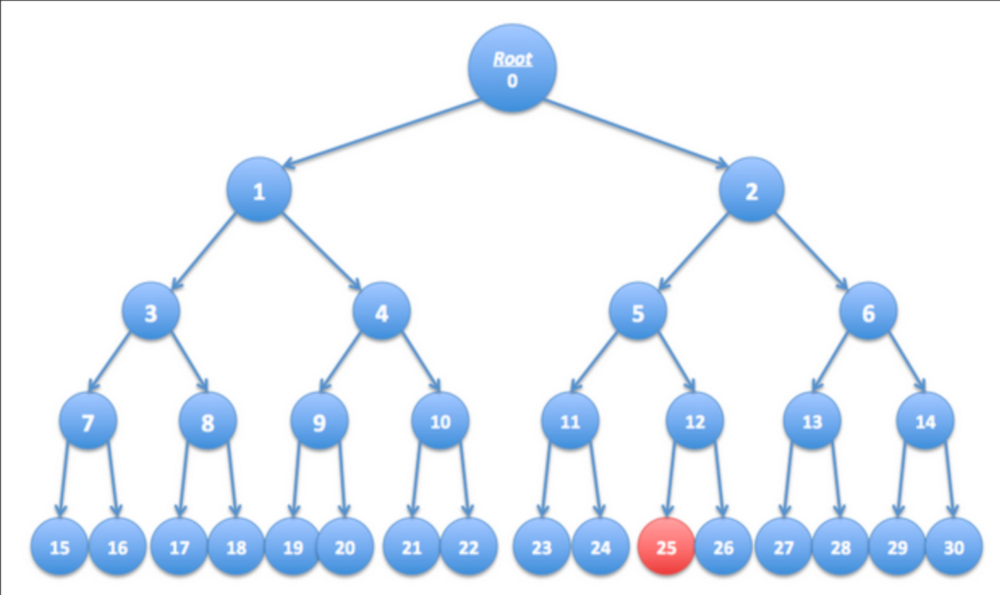

# Lab3 流密码习题集答案

## 第1题
**答案**：[x] 先压缩，再加密
**解析**：加密后数据为随机分布，无法压缩；先压缩再加密，既节省存储空间，又不影响加密安全性。

## 第2题
**答案**：
[x] G'(k) = G(k) ⊕ 1^s
[x] G'(k) = G(k)[0, ..., n-2]
[x] G'(k) = G(k) ⊕ 1^n
**解析**：异或固定串、截断末尾比特均不破坏伪随机性；固定输出、重复输出、拼接固定比特会破坏安全性。

## 第3题
**答案**：0.25
**解析**：
- 真随机串LSB为0的概率为0.5
- G'的LSB仅当G(k1)、G(k2)的LSB均为1时为1，否则为0，P(LSB=0)=0.75
- 优势=|0.75-0.5|=0.25

## 第4题
**答案**：[x] p₁=(k₁,k₂), p₂=(k₁',k₂), p₃=(k₁,k₂')
**解析**：任意两份可通过异或恢复k，单独一份无法获取k的完整信息，满足三份拆分要求。

## 第5题
**答案**：[x] 不是，该密码存在简单的攻击方式
**解析**：该密码为移位密码，可通过频率分析破解，不满足完美保密性要求（仅OTP满足完美保密）。

## 第6题
**答案**：
[x] E'(k,m) = reverse(E(k,m))
[x] E'(k,m) = 0 | E(k,m)
**解析**：仅翻转密文顺序、前缀加0不泄露明文信息；泄露LSB、密钥、重复加密会破坏语义安全性。

## 第7题
**答案**：6c73d5240a948c86981bc290814d
**解析**：OTP公式c=m⊕k，k=m₁⊕c₁，仅最后一个字母不同，仅修改对应位置密文即可。

## 第8题
**答案**：选择节点24、28、6、1
**解析**：选择25号节点的兄弟节点及父节点的兄弟节点，共4个，覆盖除25外所有叶子节点。

## 第9题
**答案**：[x] log₂n
**解析**：n个叶子的二叉树高度为log₂n，禁用一个叶子需加密其兄弟链上的log₂n个节点。

## 第10题
**答案**：选择节点17、19、24、26、12、9
**解析**：选择最小密钥集合，覆盖除16、18、25外的所有叶子节点，共6个。

## 第11题
**答案**：[x] |K| = 26! (26的阶乘)
**解析**：替换密码为26个字母的全排列，密钥空间大小为26的阶乘。

## 第12题
**答案**：[x] "E"
**解析**：英文文本中字母E的出现频率最高，约为12.7%。

## 第13题
**答案**：1101101
**解析**：逐位异或计算：0⊕1=1，1⊕0=1，1⊕1=0，0⊕1=1，1⊕0=1，1⊕1=0，1⊕0=1。

## 第14题
**答案**：[x] 任何随机变量与独立的均匀随机变量异或后，结果仍是均匀分布
**解析**：异或的核心性质，均匀随机变量作为掩码可将任意分布转换为均匀分布。

## 第15题
**答案**：[x] 能，密钥是 k = m ⊕ c₀
**解析**：OTP加密公式c=m⊕k，变形得k=m⊕c，可由明文和密文唯一计算出密钥。

## 第16题
**答案**：[x] 1
**解析**：OTP中k=m⊕c唯一确定，因此仅存在1个密钥将m映射为c。

## 第17题
**答案**：[x] 不能，因为密钥比消息短
**解析**：完美保密性要求密钥长度≥消息长度，流密码通过PRG扩展密钥，密钥长度短于消息，不满足条件。

## 第18题
**答案**：[x] 是的，给定前 (n-1) 个比特我可以预测第 n 个比特
**解析**：所有比特异或为1，第n个比特=前n-1个比特异或的结果，可完全预测。

## 第19题
**答案**：[x] 是
**解析**：可通过后n/2比特计算出前n/2比特，存在可预测性，不满足PRG安全性。

## 第20题
### (a) PRG优势定义
**答案**：Adv_PRG[A,G] = |Pr[A(G(k)) = 1] - Pr[A(r) = 1]|，其中k←K为均匀随机密钥，r←{0,1}^n为真随机串。
### (b) 优势含义
**答案**：
- 优势接近1：测试A可有效区分G的输出与真随机串，G不安全；
- 优势接近0：测试A无法区分，G安全。
### (c) A(x)=0时的优势
**答案**：0
**解析**：Pr[A(G(k))=1]=0，Pr[A(r)=1]=0，差的绝对值为0。

## 第21题
### (a) Pr[A(G(k))=1]
**答案**：2/3
### (b) Pr[A(r)=1]
**答案**：1/2
### (c) Adv_PRG[A,G]
**答案**：|2/3 - 1/2| = 1/6 ≈ 0.1667
### (d) PRG是否安全
**答案**：不安全。优势1/6远大于0，存在统计测试可区分G的输出与真随机串，不满足PRG安全性要求。

## 第22题
### (a) 完美保密性定义
**答案**：对任意明文m∈M、密文c∈C，满足Pr_k[E(k,m)=c] = Pr_k[E(k,m')=c]对所有m'∈M成立，即密文分布与明文无关。
### (b) OTP中密钥数量
**答案**：恰好1个。
**解析**：OTP中k=m⊕c唯一确定，因此仅存在1个密钥满足E(k,m)=c。
### (c) OTP完美保密性证明
**答案**：
对任意m,c，恰好有1个密钥k=m⊕c满足E(k,m)=c，密钥均匀随机，因此Pr[E(k,m)=c]=1/|K|。
同理，Pr[E(k,m')=c]=1/|K|，两者相等，满足完美保密性定义。

## 第23题
### (a) 证明E不是语义安全的
**答案**：语义安全要求密文不泄露明文任何信息，而算法A可从密文推断出LSB(m)，说明密文泄露明文信息，因此E不是语义安全的。
### (b) 构造攻击者B
**答案**：
- 选择两条消息：m₀（LSB=0）、m₁（LSB=1）；
- 收到密文c后，用A计算LSB(m)，若为0则猜b=0，若为1则猜b=1。
### (c) Adv_SS[B,E]
**答案**：1
**解析**：B可100%正确猜测b，优势为|1 - 1/2|×2=1。

## 第24题
### (a) EXP(0)中密文均匀分布证明
**答案**：k为均匀随机串，m₀为固定明文，由异或性质，固定串与独立均匀随机串异或后仍为均匀分布，因此c=k⊕m₀均匀分布。
### (b) EXP(1)中密文均匀分布证明
**答案**：同理，m₁为固定明文，k均匀随机，c=k⊕m₁仍为均匀分布。
### (c) 密文分布相同说明
**答案**：两个实验中密文均服从{0,1}^n上的均匀分布，因此分布完全相同。
### (d) OTP语义安全证明
**答案**：语义安全优势为|Pr[A(c)=0|EXP(0)] - Pr[A(c)=0|EXP(1)]|，由(c)知两个分布相同，差的绝对值为0，因此OTP语义安全。
